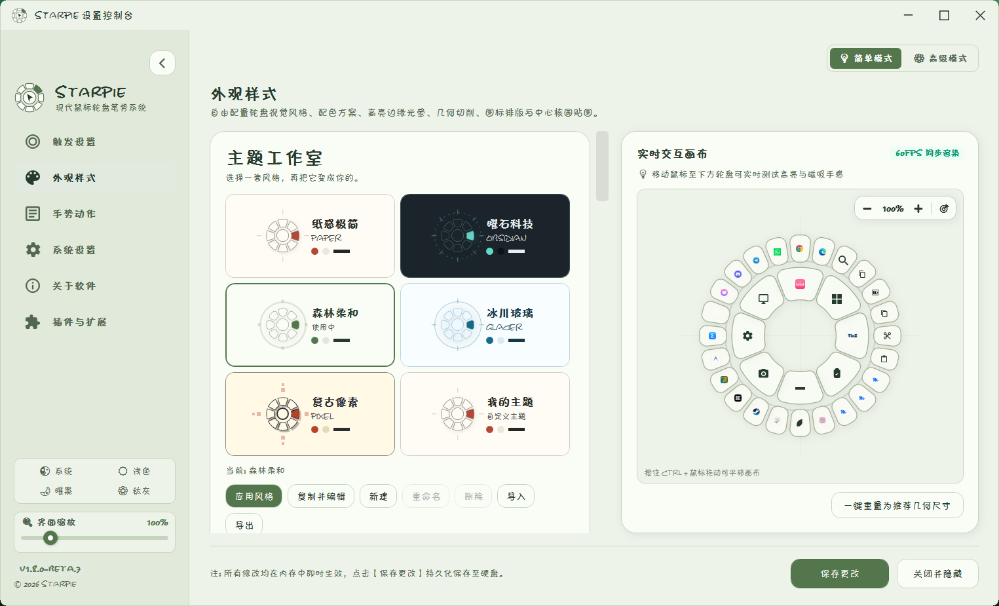
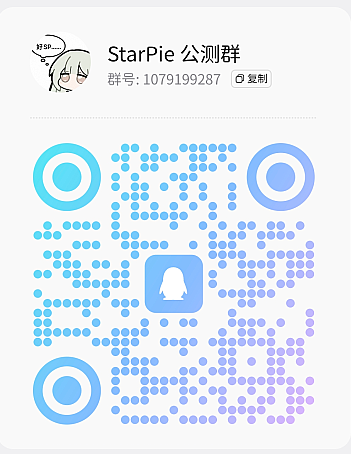

<div align="center">


# StarPie

### Lightweight, Fast & Configurable Radial Pie Menu for Windows 10 / 11

[](https://github.com/Star-Pie/StarPie/releases)
[-0078D4.svg?style=flat-square&logo=windows)](https://microsoft.com/windows)
[](https://dotnet.microsoft.com/)
[](LICENSE)
[](tests/)
[](#i18n)
[](https://github.com/Star-Pie/StarPie/releases)
[](https://qm.qq.com/q/y1J4gxkUTu)

<br/>

**[简体中文](README.md)** • **[English](README_EN.md)**

<br/>

[🌟 Highlights](#highlights) • [🚀 Quick Start](#download) • [✨ Features](#features) • [🎨 Visual Customization](#visuals) • [🌐 Languages](#i18n) • [🛠️ Build & Development](#build) • [📋 Changelog](CHANGELOG.md) • [🧪 Beta Testing](#beta)

[🤝 Contributing](#contributing) • [⭐ Star History](#star-history) • [💬 Community](#community) • [❤️ Support](#support) • [📌 Project Status](#project-status) • [🙏 Special Thanks](#special-thanks)

</div>

---

<a id="intro"></a>

## 📖 Introduction

**StarPie** is a lightweight radial mouse-gesture productivity tool for Windows 10 / 11.

> [!NOTE]
> **Stable release: v1.7.4 (September 19, 2026)**. Everyday features and downloads follow the [v1.7.4 Release](https://github.com/Star-Pie/StarPie/releases/tag/v1.7.4). The [plugin system](#plugins), Theme Studio, and other features marked **v1.8.0 Beta** are still under testing and are not part of v1.7.4 stable.

In everyday use, summon the wheel with the **right, middle, or side mouse button, or a keyboard trigger**, or run actions through independent trail gestures. The v1.7.4 stable release supports 4 / 8 / 12 directions, secondary actions, per-app profiles, window management and tiling, screen OCR, shortcut recording, URL and command execution, and customizable visual layouts, turning frequent operations into muscle memory.

> 💡 **Design Highlights**:
> - **Low resource usage**: native C# WPF without a bundled browser engine, targeting a quiet-background working set of **15–30 MB**; actual usage varies by environment and enabled features.
> - **Low-latency response**: based on the Win32 `WH_MOUSE_LL` event stream, without interfering with ordinary right-clicks.
> - **Portable use**: a self-contained single-file build includes the .NET runtime; extract and run, with configuration stored locally in `config.json`.

---

<a id="demo"></a>

## 🎬 Demo Videos

<div align="center">

[](https://www.bilibili.com/video/BV1cubL6WEpB)

</div>

<details open>
<summary><b>🎬 Demo Video</b></summary>
<br/>

<div align="center">
  <a href="https://www.bilibili.com/video/BV1XjtA6KEGL" target="_blank">
    
  </a>
  <p>
    <a href="https://www.bilibili.com/video/BV1XjtA6KEGL"><b>📺 Watch the narrated walkthrough and live demo on Bilibili</b></a>
  </p>
</div>
</details>

---

<a id="highlights"></a>

## 🌟 v1.7.4 Stable Release Highlights

StarPie **v1.7.4** retains radial wheels, trail gestures, window management, and screen OCR while introducing **native Quick Finder search, per-app isolation and layer-aware inheritance, custom interaction sounds, streamlined settings, rendering optimizations, and an installer**.

| Area | Current Capabilities |
| :--- | :--- |
| **Wheel Interaction** | 4 / 8 / 12 sectors, center-core actions, cascading sub-wheels, honeycomb fans, and outer-escape cancellation |
| **Trail Gestures** | Up to three segments, eight-direction combinations, trail overlays, segment sensitivity, and release hints |
| **Actions and Windows** | Hotkeys, apps, URLs, folders, commands, system controls, window switching, tiling, cross-monitor moves, pinning, and transparency |
| **Screen OCR** | Offline Windows recognition, AI vision APIs, and custom HTTP OCR |
| **Configuration** | Two-pane focused editing, live wheel preview, sector drag-to-swap, running-window capture, and compact action lists |
| **Visual Customization** | Multiple wheel shapes, independent primary/secondary themes, per-sector fonts/icons/text placement, and screen-edge adaptation |
| **Native Quick Finder** | No Everything dependency; app pre-indexing, category filters, search controls, and keyboard shortcuts |
| **Interaction Sounds** | Five event sounds in advanced mode, synthesized waveforms or local WAV, and preset import/export |
| **Installation and Upgrades** | Setup installer, Standalone portable package, and Lightweight portable package |

> 📋 See [CHANGELOG.md](CHANGELOG.md) for the full version history.

---

<a id="features"></a>

## ✨ Features

### 1. ⚡ Quick Gesture Summon & Action Trigger

- Hold the right mouse button and drag past the configured threshold to summon the wheel; release over a sector to run its action, such as a hotkey, application, folder, or system function.
- Ordinary right-clicks still open the native context menu without interference.
- Use the right, middle, or side mouse button, a keyboard key, or modifier-key combination as the trigger; choose drag-distance or long-press activation.
- Shortcut recording can temporarily capture input exclusively and pause global hotkeys to prevent accidentally running combinations such as `Win + D` or `Alt + Tab`.

<div align="center">
  
  <br/><br/>
  
</div>

---

### 2. 🌟 Multi-Level Cascading Sub-Wheels

- **Cascading interaction**: add 1–4 secondary actions to any sector. Hover inside the primary sector to expand the outer sub-sectors with an elastic animation, then move outward to trigger one.
- **Independent themes and colors**: customize dimensions, font sizes, and icon placement per level. Secondary wheels can either synchronize with the primary wheel or use their own style and palette.
- Choose outer sub-rings or honeycomb fans, with hysteresis and debouncing to reduce flicker and unintended closing near boundaries.
- Swap primary and secondary actions by dragging; optionally move their associated secondary actions when swapping primary sectors.

<div align="center">
  
  <br/><br/>
  
</div>

---

### 3. 🚀 Outer Escape Cancel

- Cancel a gesture without pulling the pointer back to the center core.
- Flick outward beyond the wheel edge to enter a translucent cancellation state; releasing the right mouse button will not execute an action.
- Enable or disable the feature in settings and adjust its distance sensitivity from 140px to 320px. Outer-escape cancellation can also run an independent action or preset, while center-core cancellation can remain silent.

<div align="center">
  
</div>

---

<a id="visuals"></a>

### 4. 🎨 Multiple Wheel Shapes & Style Presets

- **Four shapes**: compact sectors (Original), floating circles (Circle), rounded capsules (Capsule), and honeycomb hexagons (HexagonHive).
- **Theme presets**: system-following, light, dark, liquid glass, matcha forest, glacier blue, and muted Morandi gray.
- The **live interactive preview canvas** supports zooming, panning, resetting, click-to-select, and drag-to-swap, with immediate feedback and screen-edge overflow protection using X/Y safety margins.

<div align="center">
  
  <br/><br/>
  
</div>

---

### 5. 🎯 Adaptive 4 / 8 / 12 Sector Layouts

- **Four directions**: broad up/down/left/right sectors for eyes-free operation.
- **Eight directions**: the balanced eight-way layout used by default.
- **Twelve directions**: dense mappings for workflows with more actions. The center core can have its own action, with configurable activation dead-zone sensitivity.

<div align="center">
  
</div>

---

### 6. 💼 Per-App Profiles

- Assign dedicated wheel profiles to foreground apps such as Chrome, VS Code, Photoshop, or SolidWorks.
- StarPie automatically matches the active app and falls back to the global profile when there is no dedicated profile.
- Create, duplicate, delete, and rename profiles to reuse and maintain workflows.
- **v1.7.4 inheritance rules**: new per-app profiles disable inheritance from unconfigured global slots by default. When enabled, layer N inherits from global layer N; layers beyond the global layer count fall back to global layer 1.
- Center-core actions follow the active layer, with outer sub-wheels and highlight states refreshed when layers change.

<div align="center">
  
</div>

---

### 7. 🎛️ Action Configuration, Quick App Capture & Drag-to-Edit

- The Actions page provides a two-pane workspace with a profile selector, focused editing cards, and a live wheel canvas, plus a compact list for reviewing multiple actions.
- A smart app picker lists installed applications with name search and filtering.
- Capture a running desktop window or process to avoid manually locating executable files.
- Select sectors on the canvas and drag to swap primary sectors, secondary actions, and the center core.
- Enable an independent center-core action, with dead-zone release triggering, presets, and separate text/icon layout.
- Override layout mode, font, font size, text color, icon size, text placement, and X/Y offsets for individual sectors.

<div align="center">
   
    <br/><br/>
  
</div>

---

<a id="i18n"></a>

### 8. 🛡️ Scene Isolation, Fullscreen Safety & Multilingual

- **Fullscreen and game detection**: allow native right-clicks while an exclusive-fullscreen app or game is running.
- **Modifier bypass**: bypass the wheel while holding Ctrl, Shift, or Alt.
- **Process exclusions**: exclude specified processes from gesture activation.
- **Live language switching**: built-in Simplified Chinese, Traditional Chinese, English, and Japanese switch immediately. `ScreenHelper` handles multiple monitors, mixed DPI, and screen-edge coordinates to reduce secondary-monitor drift and overflow.

<div align="center">
  
  <br/><br/>
  
</div>

---

### 9. ➡️ Independent Trail Gestures & Visual Hints

- Assign a right, middle, or side mouse button to trail gestures separately from the wheel trigger.
- Use up to three segments and eight directions, with short-segment filtering and adjacent same-direction merging to reduce jitter.
- A transparent overlay shows the trail, starting point, and release hints, with adjustable segment sensitivity and hint placement.
- Clicks below the drag threshold are replayed as native mouse clicks, preserving normal use.

<div align="center">

</div>

---

### 10. 🧰 Action Types

| Action Type | Purpose |
| :--- | :--- |
| **Hotkeys** | Record or compose key combinations, with primary-key search, Pause/Break support, and exclusive recording |
| **Launch Applications** | Open EXEs, shortcuts, or files with arguments and normal-privilege launching |
| **Open URLs** | Use the system default, Chrome, Edge, Firefox, or a custom browser |
| **Open Folders** | Open local paths and system locations such as Desktop or Downloads |
| **Run Commands** | CMD, PowerShell, WSL, and hidden-terminal modes |
| **Screen OCR** | Select a screen region for local, AI, or custom HTTP recognition |
| **Window Management** | Switch, tile, move across monitors, pin, or adjust transparency |
| **System Controls** | Lock, volume, media, Task View, virtual desktops, and other system functions |

Action execution and display icons are independent: each action can use a built-in vector icon, program icon, or custom image regardless of its action type.

---

<a id="beta"></a>

## 🧪 v1.8.0 Beta Testing

This section groups the plugin system and Theme Studio, both still under testing and not part of v1.7.4 stable.

<a id="plugins"></a>

### 🧩 Plugin System

> [!IMPORTANT]
> This plugin system is **currently under v1.8.0 Beta testing**, not part of v1.7.4 stable. Built-in stable actions are being split into official plugins on the Beta line; upgrading may require installing corresponding modules. Follow the [plugin documentation](plugin/README.md) and SDK contracts for the Beta version you use.

StarPie uses a lightweight **.NET in-process DLL plugin architecture**. Plugins reference the standalone
`StarPie.Plugin.Abstractions` contract assembly and register actions and other contributions through `Initialize`. The host creates
a wrapper per plugin to manage scanning, loading, lazy activation, invocation leases, exception isolation, asynchronous disabling, and assembly unloading.

The Beta action pipeline covers registration, configuration, parameter validation, and Sequential/Background scheduling.
Interaction events and wheel structures also have extension points, allowing further expansion without duplicating the plugin lifecycle.

> 📖 **Plugin development**: current documentation, APIs, architecture, examples, and historical material are collected in [StarPie Plugin Resources](plugin/README.md).
> 🔗 **Official plugin repository**: [StarPie-Official-Plugins](https://github.com/Star-Pie/StarPie-Official-Plugins). Its checkout at `plugin/StarPie-Official-Plugins/` is a Git submodule. Official-plugin source, packaging, and releases are maintained there; the main repository does not duplicate their builds or bundle official plugin DLLs.

- **Manual installation and the first-time setup exception (v1.8.0 Beta)**:
  - **No pre-bundled modules**: release packages do not carry official plugin DLLs; plugin startup and background operation do not automatically make network requests.
  - **First-time informed consent**: when settings are first opened interactively—not in silent startup or self-test mode—and the plugin system is enabled and healthy, a one-time prompt lists five core modules (`folder`, `weburl`, `launch`, `system`, `shelltool`), their official source, and the `Process` and `InputSimulation` permissions.
  - **No requests before consent**: the host does not fetch the catalog or packages before the user chooses Install All. It installs only missing modules, skipping installed modules without replacing, upgrading, or re-enabling them. Permissions beyond those shown require another confirmation.
  - **Persistent retry entry**: dismissing the prompt or a partial download failure leaves an install/retry entry in plugin settings; completed installations are retained.
- **Local community installation**: place a community `.dll` in the **`plugin` folder beside the executable**, rescan, and install from its candidate card, or select the file with the manual community-plugin installer.
- **⚠️ Dropping a `.dll` into `plugin` copies only that DLL**: icons, resources, and dependencies are not copied with it. For a **full-package installation**, select the DLL beside `plugin.json` through the manual installer; recognizing the manifest enables whole-directory copying.
- **Separate directory responsibilities**:

  | Directory | Role |
  | :--- | :--- |
  | `<install dir>\plugin\` | **Community candidate area** for manual DLL installation; StarPie reads it without creating or writing files |
  | `%LOCALAPPDATA%\StarPie\plugin-data\` | **Writable data** for installed copies, enabled states, and private plugin data; removed on uninstall |

- **Installation and enabling are separate**: newly installed plugins remain disabled until explicitly enabled. Installation presents the ID, version, author, target framework, architecture, SHA-256, signature status, and declared capabilities.
- **Explicit candidate status**: installable, newer, older, same version installed, content changed, duplicate ID, or unrecognized. Two files declaring the same ID are both flagged as duplicates and cannot be installed.
- **Fail-safe behavior**: loading failures and repeated exceptions isolate individual plugins without affecting the host. Two consecutive abnormal startups enter safe mode and temporarily disable suspect plugins.
- **For plugin authors**: start with the current quick start and source references in [plugin/README.md](plugin/README.md). Historical `plugin/samples/` templates are not in this checkout; current `FloatingBall` source lives in the official-plugin submodule. For debugging, use
  `StarPie.exe --plugin-selftest <plugin.dll> [report path] --skip-invoke` in a temporary sandbox without touching installed plugins,
  or use `StarPie.exe --plugin-paths` to inspect the effective directories.

<a id="art-style-beta"></a>

### 🎨 Theme Studio

> [!IMPORTANT]
> Theme Studio belongs to the v1.8.0 Beta development line and is not included in v1.7.4 stable. For stable wheel shapes and colors, see [Visual Customization](#visuals).

Theme Studio in appearance settings offers five styles: paper-like minimalism, obsidian-style tech, soft forest, glacier glass, and retro pixels. Copy and edit colors, fonts, corner radii, and wheel materials, with live preview and theme import/export.

<div align="center">
  
</div>

See the [Theme Studio documentation](docs/art-style-themes.md) or [importable examples](themes/). Existing configuration and independent wheel colors are preserved.

---

<a id="download"></a>

## 🚀 Quick Start & Download

**Current stable release: [v1.7.4](https://github.com/Star-Pie/StarPie/releases/tag/v1.7.4) (September 19, 2026)**. Setup and Standalone include .NET 8; Lightweight requires the .NET 8 Desktop Runtime on the target computer.

| Package | Recommended For | Description | Download |
| :--- | :--- | :--- | :--- |
| **Setup Installer** | Guided installation, uninstall, and upgrades | Includes .NET; detects a running StarPie during installation | [Download Setup](https://github.com/Star-Pie/StarPie/releases/download/v1.7.4/StarPie-v1.7.4-Setup-win-x64.exe) |
| **Standalone Portable** | Extract-and-run use without installation | Includes the .NET runtime | [Download Standalone](https://github.com/Star-Pie/StarPie/releases/download/v1.7.4/StarPie-v1.7.4-Standalone-win-x64.zip) |
| **Lightweight Portable** | Computers with .NET 8 Desktop Runtime installed | Does not include the .NET runtime | [Download Lightweight](https://github.com/Star-Pie/StarPie/releases/download/v1.7.4/StarPie-v1.7.4-Lightweight-win-x64.zip) |
| **Preview and Historical Releases** | Beta testing or version rollback | v1.8.0 is a Beta line; distinguish Pre-release builds from stable releases | [Browse Releases](https://github.com/Star-Pie/StarPie/releases) |

The release page also provides `SHA256SUMS.txt` for download verification. After upgrading to v1.7.4, review profile inheritance, multi-layer actions, center-core actions, and sound presets.

### Basic Workflow:
1. Download and run `StarPie.exe`; the app runs quietly in the system tray.
2. Double-click the tray icon to open settings and record the wheel trigger in trigger settings.
3. Hold the trigger and drag past the threshold, or long-press as configured, to summon the wheel near the cursor.
4. Move over the desired sector and release to execute its action; flick outward to cancel or run the configured cancellation action.
5. To use trail gestures, enable a dedicated gesture trigger and map one-to-three-segment direction combinations on the Actions page.

---

<a id="build"></a>

## 🛠️ Local Build & Development

The commands below check out the **v1.7.4 stable tag**. For **v1.8.0 Beta** development, clone the default `main` branch and consult the [plugin documentation](plugin/README.md); development source may be ahead of stable releases.

### Requirements

- Windows 10 / 11 (x64)
- [.NET 8.0 SDK](https://dotnet.microsoft.com/download/dotnet/8.0)
- Python 3.10+ (only needed to run the automated test suite)

### Build & Run

```bash
# 1. Clone the repository
git clone --branch v1.7.4 https://github.com/Star-Pie/StarPie.git
cd StarPie

# 2. Build the project (Release)
dotnet build WinPieGestures/WinPieGestures.csproj -c Release

# 3. Run the project
dotnet run --project WinPieGestures/WinPieGestures.csproj

# 4. Publish Lightweight (requires .NET 8 Desktop Runtime on the target computer)
dotnet publish WinPieGestures/WinPieGestures.csproj -c Release -r win-x64 --no-self-contained -o releases/local/Lightweight

# 5. Publish Standalone (includes the .NET runtime)
dotnet publish WinPieGestures/WinPieGestures.csproj -c Release -r win-x64 --self-contained true -p:PublishSingleFile=true -p:IncludeNativeLibrariesForSelfExtract=true -o releases/local/Standalone
```

---

<a id="project-status"></a>

## 📌 Project Status


- **Stable release**: [v1.7.4](https://github.com/Star-Pie/StarPie/releases/tag/v1.7.4), released September 19, 2026.
- **Testing line**: v1.8.0 Beta; the plugin system is still under testing. See [Releases](https://github.com/Star-Pie/StarPie/releases) and [CHANGELOG.md](CHANGELOG.md) for preview packages and version history.

---

<a id="community"></a>

## 💬 Community

<table>
  <thead>
    <tr>
      <th>QQ Public Testing Group</th>
    </tr>
  </thead>
  <tbody>
    <tr>
      <td align="center">
        
      </td>
    </tr>
  </tbody>
</table>

Scan the QR code with QQ to join the **StarPie public testing group**. Group number: **1079199287**.

You are also welcome to connect with us on GitHub:

| Channel | Purpose |
| --- | --- |
| [GitHub Discussions](https://github.com/Star-Pie/StarPie/discussions) | Exchange tips, share themes and workflows, and discuss feature ideas |
| [GitHub Issues](https://github.com/Star-Pie/StarPie/issues) | Report bugs, compatibility problems, and concrete feature requests |
| [Pull Requests](https://github.com/Star-Pie/StarPie/pulls) | Submit or discuss code, documentation, and translation improvements |

Be kind, respectful, and patient. Provide reproducible details where possible, and never post passwords, API keys, or configuration files containing private information.

---

<a id="support"></a>

## ❤️ Support

If StarPie helps you, you can support the project by:

- Giving the [repository](https://github.com/Star-Pie/StarPie) a Star or sharing it with someone who could use a mouse-gesture productivity tool.
- Sharing themes, use cases, and demo assets in [Discussions](https://github.com/Star-Pie/StarPie/discussions).
- Providing reproducible feedback or improving code, translations, and documentation through the [contributing guide](CONTRIBUTING.md).

---

<a id="contributing"></a>

## 🤝 Contributing

Code, documentation, translation improvements, themes, demo assets, and compatibility feedback are welcome. Read the [contributing guide](CONTRIBUTING.md) before getting started; see the [plugin development documentation](plugin/README.md) for plugin contributions.

- **Report an issue**: search [existing Issues](https://github.com/Star-Pie/StarPie/issues) first, then include StarPie and Windows versions, reproduction steps, and relevant screenshots or logs. Remove private information before sharing logs.
- **Discuss a proposal**: for changes to interaction behavior, configuration compatibility, or plugin contracts, start with an Issue or [Discussion](https://github.com/Star-Pie/StarPie/discussions).
- **Submit improvements**: explain the purpose, verification results, and unverified areas in your [Pull Request](https://github.com/Star-Pie/StarPie/pulls). Visual changes and real system interactions still require hands-on acceptance testing.

Thank you to all [project contributors](https://github.com/Star-Pie/StarPie/graphs/contributors)!

<a id="special-thanks"></a>

### 🙏 Contributor Acknowledgements

> [!TIP]
> Every improvement to StarPie is made possible by its open-source community. Thank you to everyone who contributes code, reports issues, tests changes, improves translations, or shares themes.

<a href="https://github.com/Star-Pie/StarPie/graphs/contributors">
  
</a>

---

<a id="star-history"></a>

## ⭐ Star History

<a href="https://www.star-history.com/#Star-Pie/StarPie&Date">

  <picture>
    <source media="(prefers-color-scheme: dark)" srcset="https://api.star-history.com/svg?repos=Star-Pie/StarPie&amp;type=Date&amp;theme=dark" />
    <source media="(prefers-color-scheme: light)" srcset="https://api.star-history.com/svg?repos=Star-Pie/StarPie&amp;type=Date" />
    
  </picture>
</a>
