# StarPie 插件系统架构图

> 本文根据当前仓库实现整理插件系统的运行时架构、加载流程、注册流程、动作执行路径和停用流程。
>
> 文档中的业务节点均对应当前源码中的具体类、属性或方法；Mermaid 中的 `subgraph` 仅用于视觉分组，不代表运行时对象。
>
> 最后更新：2026-09-22

## 1. 源码范围

主要实现位于：

- `WinPieGestures/Plugin/`
- `plugin/sdk/StarPie.Plugin.Abstractions/`

核心入口文件：

```text
WinPieGestures/Plugin/PluginHost.cs
WinPieGestures/Plugin/PluginRuntime.cs
WinPieGestures/Plugin/PluginPathModules.cs
WinPieGestures/Plugin/PluginInstance.cs
WinPieGestures/Plugin/PluginCatalog.cs
WinPieGestures/Plugin/PluginContext.cs
WinPieGestures/Plugin/PluginInvoker.cs
WinPieGestures/Plugin/PluginScanner.cs
WinPieGestures/Plugin/PluginManifestReader.cs
WinPieGestures/Plugin/PluginLoadContext.cs
plugin/sdk/StarPie.Plugin.Abstractions/IStarPiePlugin.cs
plugin/sdk/StarPie.Plugin.Abstractions/IPluginContext.cs
plugin/sdk/StarPie.Plugin.Abstractions/Actions.cs
```

## 2. 总体架构

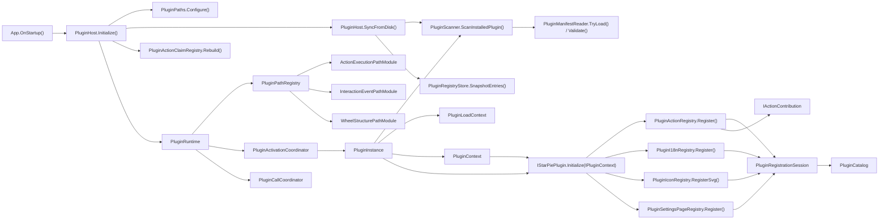
```mermaid
flowchart LR
    A["App.OnStartup()"]

    H["PluginHost.Initialize()"]
    PATHS["PluginPaths.Configure()"]
    SYNC["PluginHost.SyncFromDisk()"]
    SCAN["PluginScanner.ScanInstalledPlugin()"]
    MANIFEST["PluginManifestReader.TryLoad() / Validate()"]
    STORE["PluginRegistryStore.SnapshotEntries()"]
    CLAIM["PluginActionClaimRegistry.Rebuild()"]

    RUNTIME["PluginRuntime"]
    PATHREG["PluginPathRegistry"]
    ACTIVATION["PluginActivationCoordinator"]
    CALLS["PluginCallCoordinator"]

    ACTIONPATH["ActionExecutionPathModule"]
    EVENTPATH["InteractionEventPathModule"]
    WHEELPATH["WheelStructurePathModule"]

    INSTANCE["PluginInstance"]
    ALC["PluginLoadContext"]
    CONTEXT["PluginContext"]
    ENTRY["IStarPiePlugin.Initialize(IPluginContext)"]

    CATALOG["PluginCatalog"]
    SESSION["PluginRegistrationSession"]
    ACTIONREG["PluginActionRegistry.Register()"]
    I18NREG["PluginI18nRegistry.Register()"]
    ICONREG["PluginIconRegistry.RegisterSvg()"]
    SETTINGREG["PluginSettingsPageRegistry.Register()"]
    SDK_ACTION["IActionContribution"]

    A --> H
    H --> PATHS
    H --> SYNC
    SYNC --> SCAN
    SCAN --> MANIFEST
    SYNC --> STORE
    H --> CLAIM

    H --> RUNTIME
    RUNTIME --> PATHREG
    RUNTIME --> ACTIVATION
    RUNTIME --> CALLS

    PATHREG --> ACTIONPATH
    PATHREG --> EVENTPATH
    PATHREG --> WHEELPATH

    ACTIVATION --> INSTANCE
    INSTANCE --> SCAN
    INSTANCE --> ALC
    INSTANCE --> CONTEXT
    INSTANCE --> ENTRY
    CONTEXT --> ENTRY

    ENTRY --> ACTIONREG
    ENTRY --> I18NREG
    ENTRY --> ICONREG
    ENTRY --> SETTINGREG
    ACTIONREG --> SESSION
    I18NREG --> SESSION
    ICONREG --> SESSION
    SETTINGREG --> SESSION
    SESSION --> CATALOG
    ACTIONREG --> SDK_ACTION
```

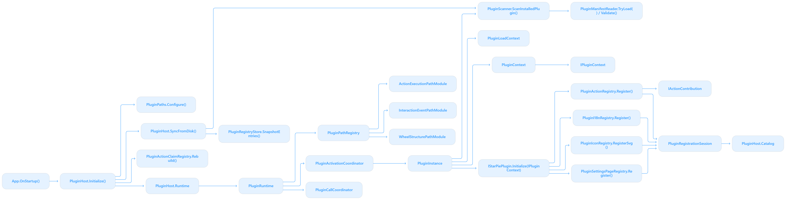


### 2.1 以 `PluginHost` 为根的调用树

下面的图只保留调用链上的重点类、成员和方法。`PluginHost` 是主程序看到的唯一插件门面；其余节点分别承担路径选择、插件激活、贡献点查找、动作执行和生命周期管理。


```mermaid
flowchart LR
    EXT_EXEC["ActionExecutor.Execute(ActionItem)"] --> PH_EXEC["PluginHost.ExecutePluginAction()"]
    EXT_CLAIM["ActionExecutor.ExecuteClaimedActionItem()"] --> PH_CLAIM["PluginHost.ExecuteClaimedAction()"]

    PH["PluginHost"]

    PH --> PH_INIT["PluginHost.Initialize()"]
    PH --> PH_INSTALL["PluginHost.CommitInstallAsync()"]
    PH --> PH_EXEC
    PH --> PH_CLAIM
    PH --> PH_RUNTIME["PluginHost.Runtime\nPluginRuntime"]
    PH --> PH_INSTANCES["PluginHost.Instances\nDictionary<string, PluginInstance>"]
    PH --> PH_CATALOG["PluginHost.Catalog\nPluginCatalog"]
    PH --> PH_STOP["PluginHost.DisableAsync()"]

    PH_INIT --> PATH_CONFIG["PluginPaths.Configure()"]
    PH_INIT --> SYNC["PluginHost.SyncFromDisk()"]
    SYNC --> STORE_SNAPSHOT["PluginRegistryStore.SnapshotEntries()"]
    SYNC --> SCAN_INSTALLED["PluginScanner.ScanInstalledPlugin()"]
    SYNC --> INSTANCE_CREATE["new PluginInstance(pluginId, entry, scan)"]
    INSTANCE_CREATE --> PH_INSTANCES
    PH_INIT --> CLAIM_REBUILD["PluginActionClaimRegistry.Rebuild()"]

    PH_INSTALL --> SCAN_SELECTED["PluginScanner.ScanSelectedDll()"]
    PH_INSTALL --> COPY_PAYLOAD["PluginHost.CopyPayload() / CopyDirectory()"]
    PH_INSTALL --> WRITE_MANIFEST["PluginManifestReader.TryWrite()"]
    PH_INSTALL --> STORE_UPSERT["PluginRegistryStore.UpsertEntry()"]
    PH_INSTALL --> CLAIM_REBUILD_INSTALL["PluginActionClaimRegistry.Rebuild()"]

    PH_RUNTIME --> RT_CTOR["PluginRuntime.PluginRuntime(...)"]
    PH_RUNTIME --> RT_ACTION["PluginRuntime.ExecuteAction()"]
    PH_RUNTIME --> RT_CLAIM["PluginRuntime.ExecuteClaimedAction()"]
    PH_RUNTIME --> RT_EVENT["PluginRuntime.RaiseWheelOpening() / RaiseWheelClosed()"]
    PH_RUNTIME --> RT_WHEEL["PluginRuntime.QueryWheelStructureAsync()"]
    PH_RUNTIME --> RT_STOP["PluginRuntime.NotifyPluginStopping()"]

    RT_CTOR --> PATH_REG["PluginPathRegistry.Register()"]
    RT_CTOR --> ACTIVATION["PluginActivationCoordinator"]
    RT_CTOR --> CALLS["PluginCallCoordinator"]
    PATH_REG --> ACTION_PATH["ActionExecutionPathModule"]
    PATH_REG --> EVENT_PATH["InteractionEventPathModule"]
    PATH_REG --> WHEEL_PATH["WheelStructurePathModule"]

    PH_EXEC --> RT_ACTION
    PH_CLAIM --> RT_CLAIM
    RT_ACTION --> CALL_ACTION["PluginCallCoordinator.Invoke()"]
    RT_CLAIM --> CALL_CLAIM["PluginCallCoordinator.Invoke()"]
    CALL_ACTION --> ACTION_EXEC["ActionExecutionPathModule.Execute()"]
    CALL_CLAIM --> ACTION_CLAIM["ActionExecutionPathModule.ExecuteClaimed()"]
    ACTION_EXEC --> REQUEST["PluginActionRequest.TryCreate()"]
    ACTION_CLAIM --> REQUEST_CLAIM["PluginActionRequest.CreateClaimed()"]
    REQUEST --> ENSURE["PluginActivationCoordinator.EnsureLoaded()"]
    REQUEST_CLAIM --> ENSURE
    ENSURE --> FIND["PluginHost.Find(pluginId)"]
    FIND --> INSTANCE["PluginInstance"]
    INSTANCE --> INSTANCE_LOAD["PluginInstance.EnsureLoaded()"]
    ACTION_EXEC --> LOOKUP["PluginCatalog.TryGetAction(fullId)"]
    ACTION_CLAIM --> LOOKUP
    LOOKUP --> VALIDATE["PluginParameterValidator.Validate()"]
    VALIDATE --> CUSTOM["IActionContribution.Validate()"]
    CUSTOM --> INVOKE["PluginInvoker.Invoke()"]
    INVOKE --> LEASE_ACQUIRE["PluginInstance.TryAcquireInvocation()"]
    LEASE_ACQUIRE --> LEASE["PluginInvocationLease"]
    INVOKE --> INPUT["new PluginActionInput(...) "]
    INVOKE --> KIND["PluginActionRegistration.Kind"]
    KIND --> SEQ["PluginInvoker.InvokeSequential()"]
    KIND --> BG["PluginInvoker.InvokeInBackground()"]
    SEQ --> CONTRIB["IActionContribution.ExecuteAsync()"]
    BG --> CONTRIB
    CONTRIB --> RESULT["ActionResult"]
    RESULT --> RECORD["PluginInstance.RecordInvoke()"]
    RECORD --> OUTCOME["PluginExecuteOutcome"]

    INSTANCE_LOAD --> SCAN_RECHECK["PluginScanner.ScanInstalledPlugin()"]
    INSTANCE_LOAD --> ALC_LOAD["PluginLoadContext.LoadFromAssemblyPath()"]
    INSTANCE_LOAD --> ENTRY_CREATE["Activator.CreateInstance(entryType)"]
    ENTRY_CREATE --> PLUGIN_REF["PluginInstance._plugin : IStarPiePlugin"]
    INSTANCE_LOAD --> CONTEXT_CREATE["new PluginContext(...)\nPluginInstance._pluginContext"]
    PLUGIN_REF --> INITIALIZE["IStarPiePlugin.Initialize(IPluginContext)"]
    CONTEXT_CREATE --> INITIALIZE
    INITIALIZE --> ACTION_REGISTER["PluginActionRegistry.Register()"]
    INITIALIZE --> I18N_REGISTER["PluginI18nRegistry.Register()"]
    INITIALIZE --> ICON_REGISTER["PluginIconRegistry.RegisterSvg()"]
    ACTION_REGISTER --> SESSION["PluginRegistrationSession.StageAction()"]
    I18N_REGISTER --> SESSION
    ICON_REGISTER --> SESSION
    SESSION --> COMMIT["PluginCatalog.Commit()"]
    COMMIT --> LOOKUP

    RT_EVENT --> CALL_EVENT["PluginCallCoordinator.Invoke()"]
    CALL_EVENT --> EVENT_RAISE["InteractionEventPathModule.RaiseWheelOpening() / RaiseWheelClosed()"]
    EVENT_RAISE --> HANDLER["PluginEventService handler"]
    HANDLER --> LEASE_EVENT["PluginInvocationLease.Dispose()"]

    RT_WHEEL --> CALL_WHEEL["PluginCallCoordinator.InvokeAsync()"]
    CALL_WHEEL --> WHEEL_QUERY["WheelStructurePathModule.QueryAsync()"]
    WHEEL_QUERY --> EMPTY["PluginWheelStructureSnapshot.Empty"]

    PH_STOP --> STOP_NOTIFY["PluginRuntime.NotifyPluginStopping()"]
    STOP_NOTIFY --> PATH_STOP["PluginPathRegistry.NotifyPluginStopping()"]
    PATH_STOP --> REVOKE["PluginCatalog.RevokeAll(pluginId)"]
    PATH_STOP --> EVENT_REMOVE["InteractionEventPathModule.OnPluginStopping()"]
    PH_STOP --> BEGIN_STOP["PluginInstance.BeginStopping()"]
    BEGIN_STOP --> CANCEL["PluginInstance._stoppingCts.Cancel()"]
    BEGIN_STOP --> DRAIN["PluginInstance._callsDrained"]
    LEASE --> RELEASE["PluginInvocationLease.Dispose()"]
    LEASE_EVENT --> RELEASE
    RELEASE --> RELEASE_CALL["PluginInstance.ReleaseInvocation()"]
    RELEASE_CALL --> DRAIN
    DRAIN --> UNLOAD["PluginInstance.Unload()"]
    UNLOAD --> SHUTDOWN["IStarPiePlugin.Shutdown()"]
    UNLOAD --> DISPOSE_TOKENS["PluginInstance.DisposeTokens()"]
    UNLOAD --> ALC_UNLOAD["PluginLoadContext.Unload()"]
```


### 2.2 这张树的阅读方式

```text
PluginHost
├─ 启动与登记
│  ├─ Initialize()
│  ├─ SyncFromDisk()
│  ├─ PluginScanner.ScanInstalledPlugin()
│  └─ PluginActionClaimRegistry.Rebuild()
│
├─ 安装
│  ├─ CommitInstallAsync()
│  ├─ PluginScanner.ScanSelectedDll()
│  ├─ CopyPayload()
│  ├─ PluginManifestReader.TryWrite()
│  └─ PluginRegistryStore.UpsertEntry()
│
├─ 运行时
│  └─ Runtime: PluginRuntime
│     ├─ Actions: ActionExecutionPathModule
│     ├─ Interactions: InteractionEventPathModule
│     ├─ WheelStructures: WheelStructurePathModule
│     ├─ Activation: PluginActivationCoordinator
│     ├─ Calls: PluginCallCoordinator
│     └─ Paths: PluginPathRegistry
│
├─ 动作执行
│  ├─ ExecutePluginAction()
│  ├─ ExecuteClaimedAction()
│  ├─ PluginCatalog.TryGetAction()
│  ├─ PluginInvoker.Invoke()
│  └─ IActionContribution.ExecuteAsync()
│
├─ 插件实例
│  └─ Instances[pluginId]: PluginInstance
│     ├─ EnsureLoaded()
│     ├─ LoadCore()
│     ├─ _plugin: IStarPiePlugin
│     ├─ _pluginContext: PluginContext
│     └─ Unload()
│
└─ 停用与卸载
   ├─ DisableAsync()
   ├─ NotifyPluginStopping()
   ├─ PluginCatalog.RevokeAll()
   ├─ BeginStopping()
   ├─ ReleaseInvocation()
   ├─ IStarPiePlugin.Shutdown()
   └─ PluginLoadContext.Unload()
```
系统可以压缩为以下职责链：

```text
App
└─ PluginHost
   ├─ PluginRuntime
   │  ├─ PluginPathRegistry
   │  ├─ PluginActivationCoordinator
   │  ├─ PluginCallCoordinator
   │  ├─ ActionExecutionPathModule
   │  ├─ InteractionEventPathModule
   │  └─ WheelStructurePathModule
   ├─ PluginInstance
   │  ├─ PluginLoadContext
   │  ├─ PluginContext
   │  └─ IStarPiePlugin
   ├─ PluginCatalog
   ├─ PluginRegistryStore
   ├─ PluginScanner
   └─ PluginActionClaimRegistry
```

## 3. 宿主启动、扫描和登记

插件系统由 `App.OnStartup()` 调用 `PluginHost.Initialize()`。

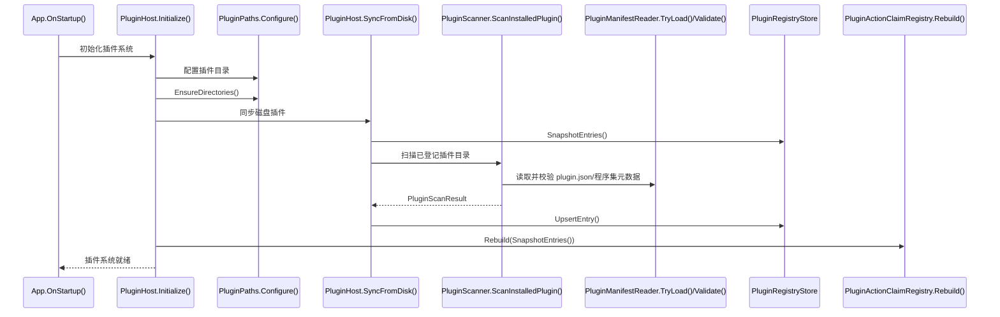
```mermaid
sequenceDiagram
    participant APP as App.OnStartup()
    participant HOST as PluginHost.Initialize()
    participant PATHS as PluginPaths.Configure()
    participant SYNC as PluginHost.SyncFromDisk()
    participant SCAN as PluginScanner.ScanInstalledPlugin()
    participant MANIFEST as PluginManifestReader.TryLoad()/Validate()
    participant STORE as PluginRegistryStore
    participant CLAIM as PluginActionClaimRegistry.Rebuild()

    APP->>HOST: 初始化插件系统
    HOST->>PATHS: 配置插件目录
    HOST->>PATHS: EnsureDirectories()
    HOST->>SYNC: 同步磁盘插件
    SYNC->>STORE: SnapshotEntries()
    SYNC->>SCAN: 扫描已登记插件目录
    SCAN->>MANIFEST: 读取并校验 plugin.json/程序集元数据
    SCAN-->>SYNC: PluginScanResult
    SYNC->>STORE: UpsertEntry()
    HOST->>CLAIM: Rebuild(SnapshotEntries())
    HOST-->>APP: 插件系统就绪
```

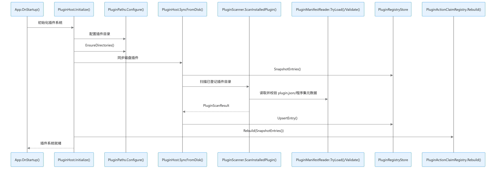


### 3.1 关键节点

| 节点 | 作用 |
|---|---|
| `App.OnStartup()` | 主程序启动入口，调用 `PluginHost.Initialize()` |
| `PluginHost.Initialize()` | 初始化插件系统，默认不加载插件程序集 |
| `PluginPaths.Configure()` | 确定插件扫描目录和宿主可写目录 |
| `PluginPaths.ScanRoot` | 社区插件候选扫描目录 |
| `PluginPaths.Root` | 宿主维护的插件目录，通常是 `plugin-data` |
| `PluginHost.SyncFromDisk()` | 根据磁盘目录和 `registry.json` 同步插件实例 |
| `PluginScanner.ScanInstalledPlugin()` | 静态检查 DLL、入口类型、目标框架、依赖和哈希 |
| `PluginManifestReader.TryLoad()` | 读取 `plugin.json` 或程序集元数据 |
| `PluginManifestReader.Validate()` | 校验插件清单 |
| `PluginRegistryStore.SnapshotEntries()` | 读取持久化登记信息 |
| `PluginActionClaimRegistry.Rebuild()` | 根据登记表构建历史动作类型认领路由 |

### 3.2 两类注册表

```text
PluginRegistryStore
└─ registry.json
   ├─ 插件 ID
   ├─ 安装目录
   ├─ Enabled
   ├─ Official
   ├─ ClaimedTypes
   ├─ 版本和哈希
   └─ 登记与健康度状态

PluginCatalog
└─ 运行时内存目录
   ├─ 已注册动作
   ├─ 图标
   ├─ 国际化词条
   └─ 插件级设置页
```

`PluginRegistryStore` 解决“磁盘上登记了什么”，`PluginCatalog` 解决“当前已加载插件贡献了什么”。

## 4. 插件安装流程

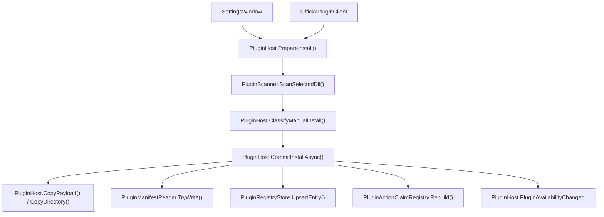
```mermaid
flowchart TD
    SETTINGS["SettingsWindow"]
    OFFICIAL["OfficialPluginClient"]
    PREPARE["PluginHost.PrepareInstall()"]
    SCAN["PluginScanner.ScanSelectedDll()"]
    CLASSIFY["PluginHost.ClassifyManualInstall()"]
    COMMIT["PluginHost.CommitInstallAsync()"]
    COPY["PluginHost.CopyPayload() / CopyDirectory()"]
    MANIFEST["PluginManifestReader.TryWrite()"]
    STORE["PluginRegistryStore.UpsertEntry()"]
    CLAIM["PluginActionClaimRegistry.Rebuild()"]
    EVENT["PluginHost.PluginAvailabilityChanged"]

    SETTINGS --> PREPARE
    OFFICIAL --> PREPARE
    PREPARE --> SCAN
    SCAN --> CLASSIFY
    CLASSIFY --> COMMIT
    COMMIT --> COPY
    COMMIT --> MANIFEST
    COMMIT --> STORE
    COMMIT --> CLAIM
    COMMIT --> EVENT
```

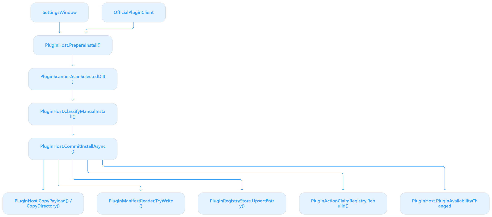


相关方法：

```text
PluginHost.PrepareInstall()
PluginScanner.ScanSelectedDll()
PluginHost.ClassifyManualInstall()
PluginHost.CommitInstallAsync()
PluginHost.CopyPayload()
PluginHost.CopyDirectory()
PluginManifestReader.TryWrite()
PluginRegistryStore.UpsertEntry()
PluginActionClaimRegistry.Rebuild()
```

安装流程的边界：

- 安装不等于加载。
- 安装不等于启用。
- `PluginInstallOptions.EnableAfterInstall` 决定安装后是否立即启用。
- 官方插件可以使用 `starpie.*` ID 和历史动作类型认领。
- 普通社区插件不能随意认领官方保留的顶层动作类型。
- 覆盖安装时清除旧 DLL 和清单，但保留插件的 `data` 和 `settings.json`。

## 5. 插件首次加载流程

插件采用惰性加载。插件登记在磁盘上，并不代表 DLL 已经加载。首次执行动作或显式预加载时，由 `PluginActivationCoordinator.EnsureLoaded()` 触发。

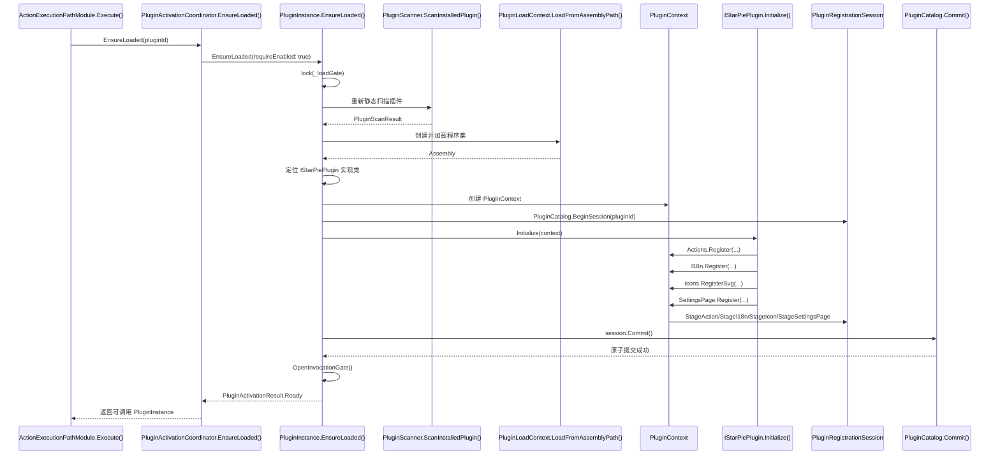
```mermaid
sequenceDiagram
    participant PATH as ActionExecutionPathModule.Execute()
    participant ACT as PluginActivationCoordinator.EnsureLoaded()
    participant INS as PluginInstance.EnsureLoaded()
    participant SCAN as PluginScanner.ScanInstalledPlugin()
    participant ALC as PluginLoadContext.LoadFromAssemblyPath()
    participant CTX as PluginContext
    participant ENTRY as IStarPiePlugin.Initialize()
    participant SESSION as PluginRegistrationSession
    participant CATALOG as PluginCatalog.Commit()

    PATH->>ACT: EnsureLoaded(pluginId)
    ACT->>INS: EnsureLoaded(requireEnabled: true)
    INS->>INS: lock(_loadGate)
    INS->>SCAN: 重新静态扫描插件
    SCAN-->>INS: PluginScanResult
    INS->>ALC: 创建并加载程序集
    ALC-->>INS: Assembly
    INS->>INS: 定位 IStarPiePlugin 实现类
    INS->>CTX: 创建 PluginContext
    INS->>SESSION: PluginCatalog.BeginSession(pluginId)
    INS->>ENTRY: Initialize(context)
    ENTRY->>CTX: Actions.Register(...)
    ENTRY->>CTX: I18n.Register(...)
    ENTRY->>CTX: Icons.RegisterSvg(...)
    ENTRY->>CTX: SettingsPage.Register(...)
    CTX->>SESSION: StageAction/StageI18n/StageIcon/StageSettingsPage
    INS->>CATALOG: session.Commit()
    CATALOG-->>INS: 原子提交成功
    INS->>INS: OpenInvocationGate()
    INS-->>ACT: PluginActivationResult.Ready
    ACT-->>PATH: 返回可调用 PluginInstance
```

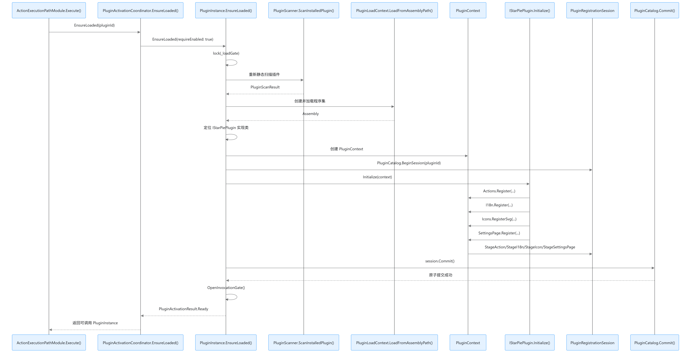


实际加载链：

```text
PluginInstance.EnsureLoaded()
└─ PluginInstance.LoadCore()
   ├─ PluginScanner.ScanInstalledPlugin()
   ├─ new PluginLoadContext(...)
   ├─ PluginLoadContext.LoadFromAssemblyPath(...)
   ├─ assembly.GetType(...)
   ├─ new PluginContext(...)
   ├─ PluginCatalog.BeginSession(...)
   ├─ IStarPiePlugin.Initialize(...)
   ├─ PluginRegistrationSession.Commit(...)
   └─ PluginInstance.OpenInvocationGate()
```

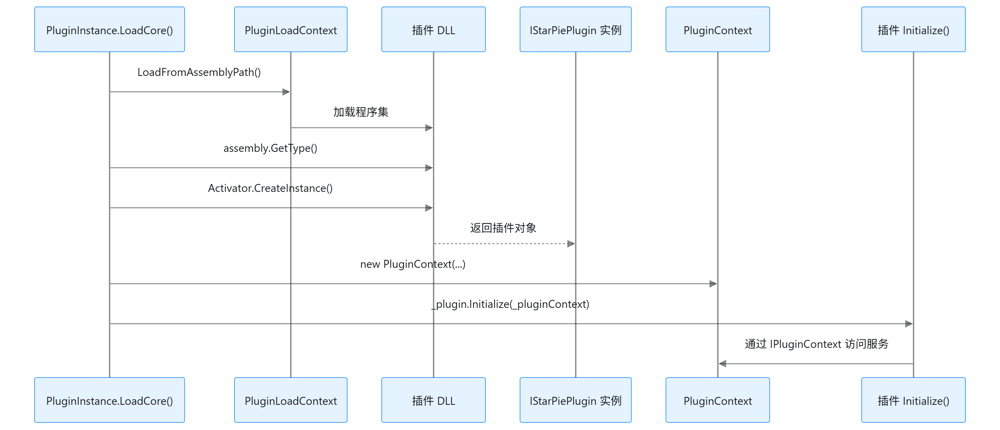

重要边界：

```text
Initialize()
└─ 只负责注册贡献点，不应执行耗时 IO、长期线程或复杂业务

Commit()
└─ Initialize 成功后一次性提交全部贡献点

Initialize 失败
└─ PluginRegistrationSession.Discard()
   不留下半个动作、半个图标或半套词条
```

## 6. `IPluginContext` 服务边界

插件不直接引用主程序的 `StarPie.dll`，而是只使用宿主创建的 `PluginContext`。

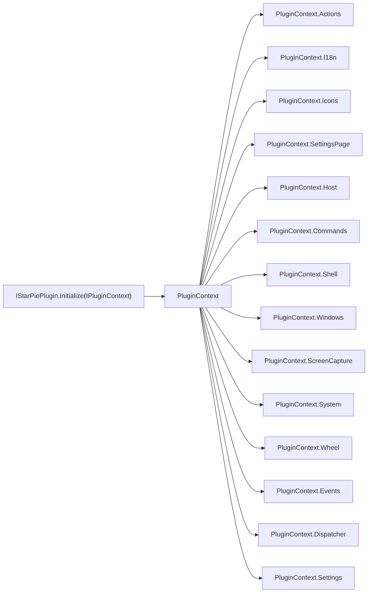
```mermaid
flowchart LR
    PLUGIN["IStarPiePlugin.Initialize(IPluginContext)"]
    CONTEXT["PluginContext"]

    ACTIONS["PluginContext.Actions"]
    I18N["PluginContext.I18n"]
    ICONS["PluginContext.Icons"]
    SETTINGS_PAGE["PluginContext.SettingsPage"]
    HOST["PluginContext.Host"]
    COMMANDS["PluginContext.Commands"]
    SHELL["PluginContext.Shell"]
    WINDOWS["PluginContext.Windows"]
    CAPTURE["PluginContext.ScreenCapture"]
    SYSTEM["PluginContext.System"]
    WHEEL["PluginContext.Wheel"]
    EVENTS["PluginContext.Events"]
    DISPATCHER["PluginContext.Dispatcher"]
    SETTINGS["PluginContext.Settings"]

    PLUGIN --> CONTEXT
    CONTEXT --> ACTIONS
    CONTEXT --> I18N
    CONTEXT --> ICONS
    CONTEXT --> SETTINGS_PAGE
    CONTEXT --> HOST
    CONTEXT --> COMMANDS
    CONTEXT --> SHELL
    CONTEXT --> WINDOWS
    CONTEXT --> CAPTURE
    CONTEXT --> SYSTEM
    CONTEXT --> WHEEL
    CONTEXT --> EVENTS
    CONTEXT --> DISPATCHER
    CONTEXT --> SETTINGS
```

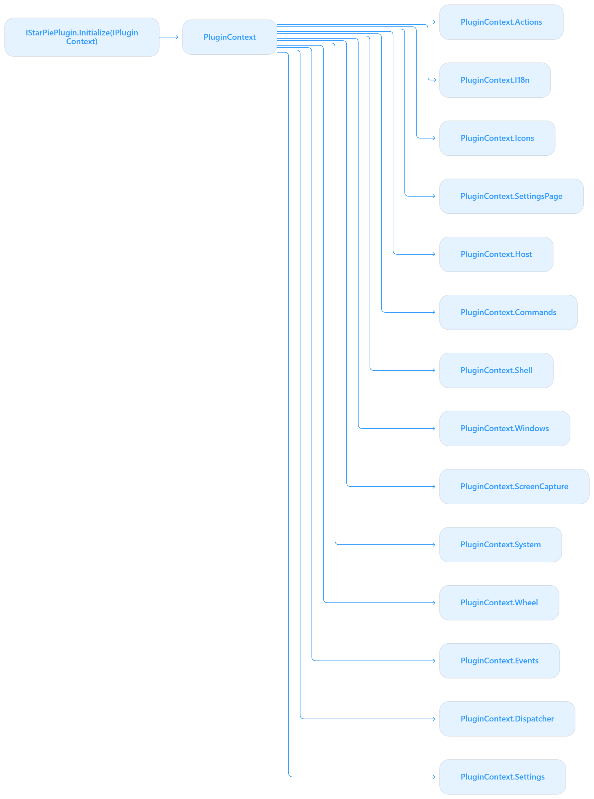


接口与实现对应关系：

| SDK 属性 | 宿主实现 |
|---|---|
| `IPluginContext.Actions` | `PluginActionRegistry` |
| `IPluginContext.I18n` | `PluginI18nRegistry` |
| `IPluginContext.Icons` | `PluginIconRegistry` |
| `IPluginContext.SettingsPage` | `PluginSettingsPageRegistry` |
| `IPluginContext.Host` | `PluginHostActionInvoker` |
| `IPluginContext.Commands` | `PluginCommandService` |
| `IPluginContext.Shell` | `PluginShellService` |
| `IPluginContext.Windows` | `PluginWindowService` |
| `IPluginContext.ScreenCapture` | `PluginScreenCaptureService` |
| `IPluginContext.System` | `PluginSystemService` |
| `IPluginContext.Wheel` | `PluginWheelService` |
| `IPluginContext.Events` | `PluginEventService` |
| `IPluginContext.Dispatcher` | `PluginDispatcherFacade` |
| `IPluginContext.Settings` | `PluginSettings` |

SDK 接口定义：

```text
plugin/sdk/StarPie.Plugin.Abstractions/IPluginContext.cs
plugin/sdk/StarPie.Plugin.Abstractions/IStarPiePlugin.cs
```

宿主实现：

```text
WinPieGestures/Plugin/PluginContext.cs
WinPieGestures/Plugin/PluginHostServices.cs
```

## 7. 动作注册流程

插件注册动作时，动作首先进入当前插件的 `PluginRegistrationSession`，不会立即写入全局运行时目录。

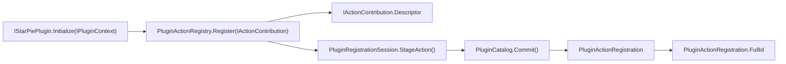
```mermaid
flowchart LR
    ENTRY["IStarPiePlugin.Initialize(IPluginContext)"]
    ACTIONREG["PluginActionRegistry.Register(IActionContribution)"]
    DESCRIPTOR["IActionContribution.Descriptor"]
    SESSION["PluginRegistrationSession.StageAction()"]
    CATALOG["PluginCatalog.Commit()"]
    REGISTRATION["PluginActionRegistration"]
    FULLID["PluginActionRegistration.FullId"]

    ENTRY --> ACTIONREG
    ACTIONREG --> DESCRIPTOR
    ACTIONREG --> SESSION
    SESSION --> CATALOG
    CATALOG --> REGISTRATION
    REGISTRATION --> FULLID
```

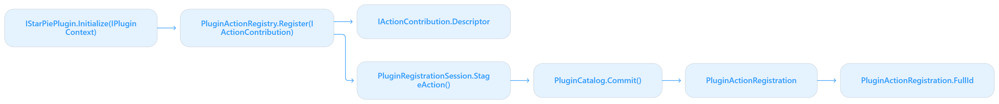


动作完整 ID：

```text
PluginActionRegistration.FullId
└─ PluginId + "." + ContributionId

示例：
starpie.plugin.cadcommand.cadCommand
```

关键节点：

| 节点 | 作用 |
|---|---|
| `IActionContribution` | 插件动作实现接口 |
| `IActionContribution.Descriptor` | 动作名称、描述、参数、执行类型、超时等 |
| `PluginActionRegistry.Register()` | 接收插件动作 |
| `PluginRegistrationSession.StageAction()` | 暂存动作 |
| `PluginCatalog.Commit()` | 初始化成功后提交动作 |
| `PluginActionRegistration` | 宿主内部动作注册记录 |
| `PluginActionRegistration.FullId` | `PluginId.ContributionId` 的完整动作 ID |
| `PluginCatalog.TryGetAction()` | 根据 FullId 查询动作 |

动作实现的主要执行方法：

```csharp
Task<ActionResult> IActionContribution.ExecuteAsync(
    PluginActionInput input,
    CancellationToken cancellationToken)
```

## 8. 动作执行主路径

这是当前插件系统中最完整、实际投入使用的调用路径。

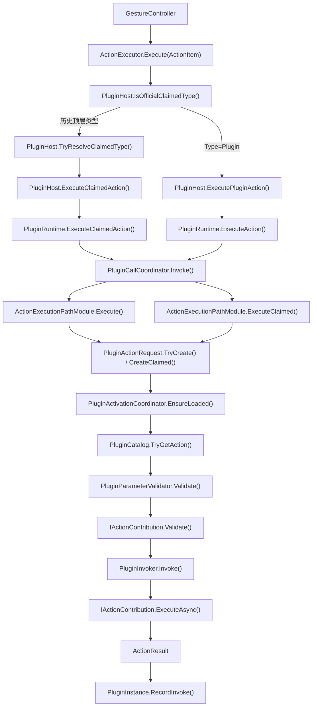
```mermaid
flowchart TD
    GESTURE["GestureController"]
    EXEC["ActionExecutor.Execute(ActionItem)"]

    CLAIM_CHECK["PluginHost.IsOfficialClaimedType()"]
    CLAIM_RESOLVE["PluginHost.TryResolveClaimedType()"]
    CLAIM_EXEC["PluginHost.ExecuteClaimedAction()"]

    PLUGIN_EXEC["PluginHost.ExecutePluginAction()"]
    RUNTIME_EXEC["PluginRuntime.ExecuteAction()"]
    RUNTIME_CLAIM["PluginRuntime.ExecuteClaimedAction()"]

    CALLS["PluginCallCoordinator.Invoke()"]
    ACTION_PATH["ActionExecutionPathModule.Execute()"]
    CLAIM_PATH["ActionExecutionPathModule.ExecuteClaimed()"]

    REQUEST["PluginActionRequest.TryCreate() / CreateClaimed()"]
    ACTIVATE["PluginActivationCoordinator.EnsureLoaded()"]
    CATALOG_GET["PluginCatalog.TryGetAction()"]
    PARAMS["PluginParameterValidator.Validate()"]
    CUSTOM_VALIDATE["IActionContribution.Validate()"]
    INVOKE["PluginInvoker.Invoke()"]
    EXECUTE_ASYNC["IActionContribution.ExecuteAsync()"]
    RESULT["ActionResult"]
    HEALTH["PluginInstance.RecordInvoke()"]

    GESTURE --> EXEC
    EXEC --> CLAIM_CHECK
    CLAIM_CHECK -->|历史顶层类型| CLAIM_RESOLVE
    CLAIM_RESOLVE --> CLAIM_EXEC
    CLAIM_EXEC --> RUNTIME_CLAIM
    RUNTIME_CLAIM --> CALLS
    CALLS --> CLAIM_PATH
    CLAIM_CHECK -->|Type=Plugin| PLUGIN_EXEC
    PLUGIN_EXEC --> RUNTIME_EXEC
    RUNTIME_EXEC --> CALLS
    CALLS --> ACTION_PATH
    ACTION_PATH --> REQUEST
    CLAIM_PATH --> REQUEST
    REQUEST --> ACTIVATE
    ACTIVATE --> CATALOG_GET
    CATALOG_GET --> PARAMS
    PARAMS --> CUSTOM_VALIDATE
    CUSTOM_VALIDATE --> INVOKE
    INVOKE --> EXECUTE_ASYNC
    EXECUTE_ASYNC --> RESULT
    RESULT --> HEALTH
```

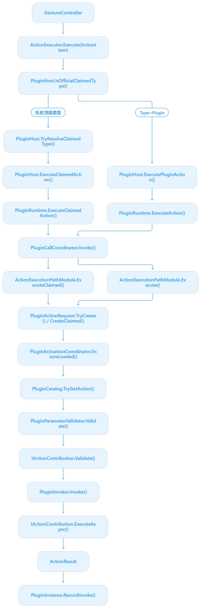


实际调用链：

```text
GestureController
└─ ActionExecutor.Execute(ActionItem)
   ├─ PluginHost.IsOfficialClaimedType()
   │  └─ PluginHost.TryResolveClaimedType()
   │     └─ PluginActionClaimRegistry.TryResolve()
   │        └─ PluginHost.ExecuteClaimedAction()
   │
   └─ PluginHost.ExecutePluginAction()
      └─ PluginRuntime.ExecuteAction()
         └─ PluginCallCoordinator.Invoke()
            └─ ActionExecutionPathModule.Execute()
               ├─ PluginActionRequest.TryCreate()
               ├─ PluginActivationCoordinator.EnsureLoaded()
               ├─ PluginCatalog.TryGetAction()
               ├─ PluginParameterValidator.Validate()
               ├─ IActionContribution.Validate()
               └─ PluginInvoker.Invoke()
                  └─ IActionContribution.ExecuteAsync()
```

## 9. `PluginInvoker` 调用治理

插件动作不能直接调用 `ExecuteAsync()`，必须经过 `PluginInvoker.Invoke()`。

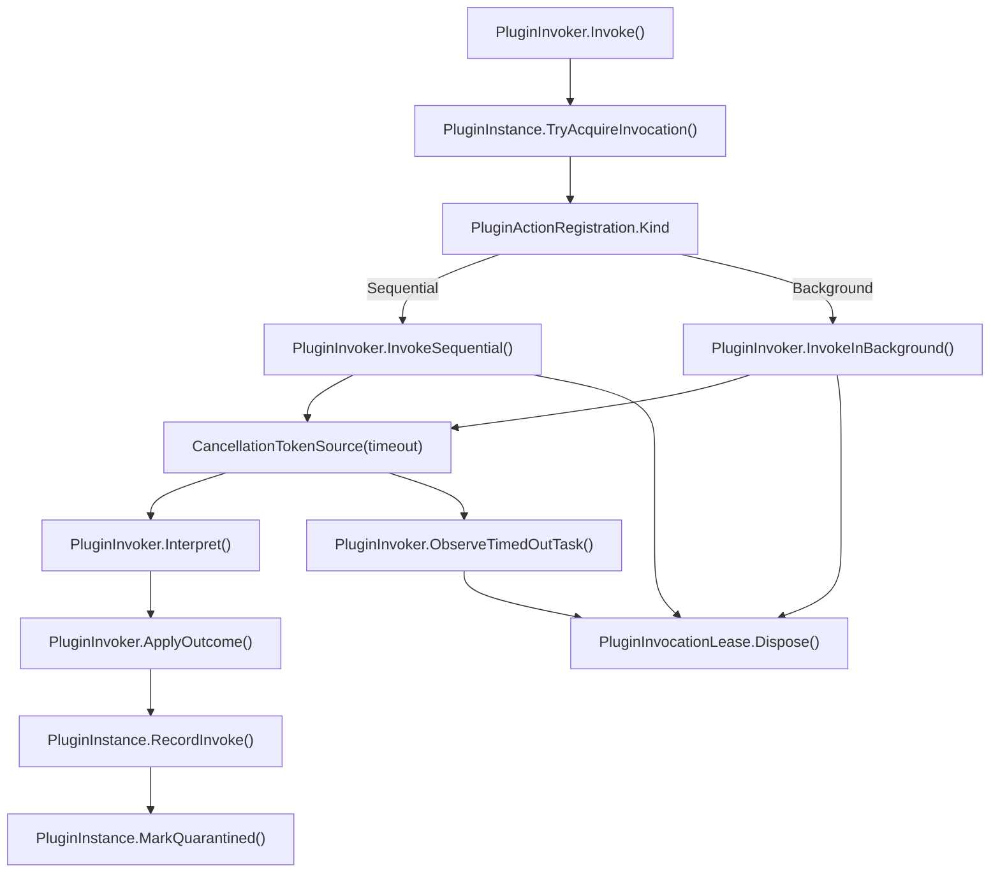
```mermaid
flowchart TD
    INVOKE["PluginInvoker.Invoke()"]
    KIND["PluginActionRegistration.Kind"]
    LEASE["PluginInstance.TryAcquireInvocation()"]
    INVOKE_SEQ["PluginInvoker.InvokeSequential()"]
    INVOKE_BG["PluginInvoker.InvokeInBackground()"]
    TIMEOUT["CancellationTokenSource(timeout)"]
    OBSERVE["PluginInvoker.ObserveTimedOutTask()"]
    DISPOSE["PluginInvocationLease.Dispose()"]
    INTERPRET["PluginInvoker.Interpret()"]
    APPLY["PluginInvoker.ApplyOutcome()"]
    RECORD["PluginInstance.RecordInvoke()"]
    QUARANTINE["PluginInstance.MarkQuarantined()"]

    INVOKE --> LEASE
    LEASE --> KIND
    KIND -->|Sequential| INVOKE_SEQ
    KIND -->|Background| INVOKE_BG
    INVOKE_SEQ --> TIMEOUT
    INVOKE_BG --> TIMEOUT
    TIMEOUT --> INTERPRET
    TIMEOUT --> OBSERVE
    OBSERVE --> DISPOSE
    INTERPRET --> APPLY
    APPLY --> RECORD
    RECORD --> QUARANTINE
    INVOKE_SEQ --> DISPOSE
    INVOKE_BG --> DISPOSE
```

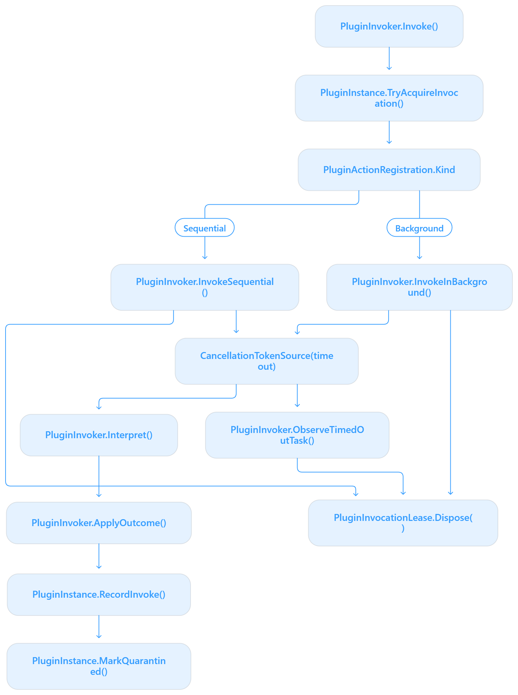


治理逻辑：

- `Sequential`：当前调用线程等待动作完成。
- `Background`：将动作放入后台任务执行，尽快返回调用路径。
- 超时后不立即认为插件已经结束。
- `ObserveTimedOutTask()` 继续观察真实任务。
- 真实任务结束后，`PluginInvocationLease.Dispose()` 才减少活动调用数。
- 连续失败达到阈值后，`PluginInstance.MarkQuarantined()` 自动隔离插件。

## 10. 活动调用租约与停用

安全卸载的核心不是直接调用 GC，而是先阻止新调用，再等待已有调用结束。

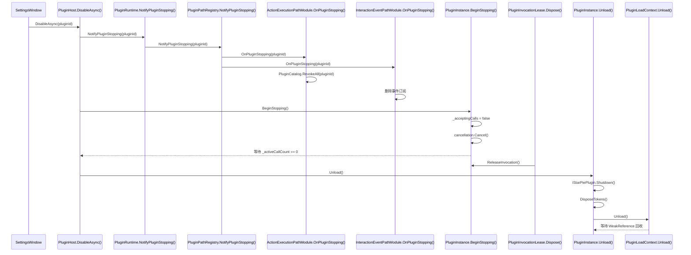
```mermaid
sequenceDiagram
    participant UI as SettingsWindow
    participant HOST as PluginHost.DisableAsync()
    participant RUNTIME as PluginRuntime.NotifyPluginStopping()
    participant PATHS as PluginPathRegistry.NotifyPluginStopping()
    participant ACTION as ActionExecutionPathModule.OnPluginStopping()
    participant EVENT as InteractionEventPathModule.OnPluginStopping()
    participant INSTANCE as PluginInstance.BeginStopping()
    participant LEASE as PluginInvocationLease.Dispose()
    participant UNLOAD as PluginInstance.Unload()
    participant ALC as PluginLoadContext.Unload()

    UI->>HOST: DisableAsync(pluginId)
    HOST->>RUNTIME: NotifyPluginStopping(pluginId)
    RUNTIME->>PATHS: NotifyPluginStopping(pluginId)
    PATHS->>ACTION: OnPluginStopping(pluginId)
    PATHS->>EVENT: OnPluginStopping(pluginId)
    ACTION->>ACTION: PluginCatalog.RevokeAll(pluginId)
    EVENT->>EVENT: 删除事件订阅
    HOST->>INSTANCE: BeginStopping()
    INSTANCE->>INSTANCE: _acceptingCalls = false
    INSTANCE->>INSTANCE: cancellation.Cancel()
    INSTANCE-->>HOST: 等待 _activeCallCount == 0
    LEASE->>INSTANCE: ReleaseInvocation()
    HOST->>UNLOAD: Unload()
    UNLOAD->>UNLOAD: IStarPiePlugin.Shutdown()
    UNLOAD->>UNLOAD: DisposeTokens()
    UNLOAD->>ALC: Unload()
    ALC-->>UNLOAD: 等待 WeakReference 回收
```

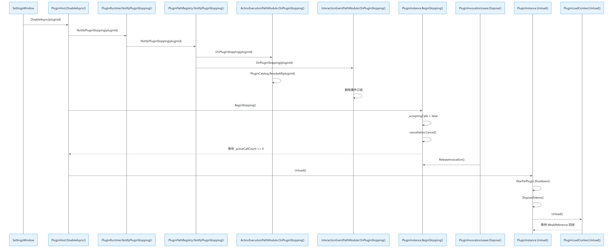


关键节点：

| 节点 | 作用 |
|---|---|
| `PluginInstance.TryAcquireInvocation()` | 判断插件是否允许新调用，并增加活动调用数 |
| `PluginInvocationLease` | 代表一次仍在执行的插件回调 |
| `PluginInvocationLease.Dispose()` | 释放调用租约 |
| `PluginInstance.BeginStopping()` | 拒绝新调用、取消停用令牌、等待活动调用排空 |
| `PluginInstance.ReleaseInvocation()` | 活动调用数减一 |
| `PluginInstance.Unload()` | 调用插件清理、断开引用、卸载 ALC |
| `IStarPiePlugin.Shutdown()` | 插件自身释放事件、线程和定时器 |
| `PluginLoadContext.Unload()` | 请求卸载插件程序集 |
| `PluginInstance.RecheckUnload()` | 延迟检查 ALC 是否真正回收 |

## 11. 插件调用宿主已有功能

插件使用 `_context.Host` 时，执行的是宿主已经实现的功能，而不是插件自行重新实现。

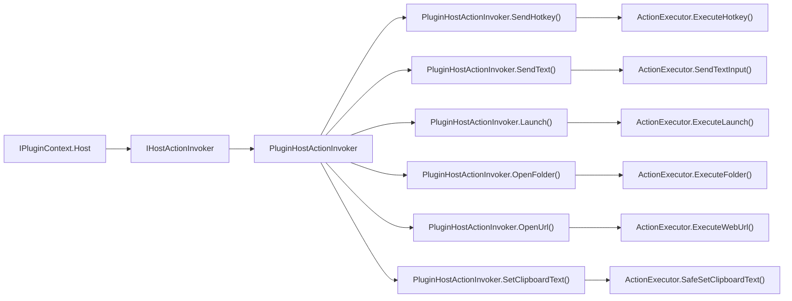
```mermaid
flowchart LR
    PLUGIN["IPluginContext.Host"]
    HOSTAPI["IHostActionInvoker"]
    INVOKER["PluginHostActionInvoker"]

    HOTKEY["PluginHostActionInvoker.SendHotkey()"]
    TEXT["PluginHostActionInvoker.SendText()"]
    LAUNCH["PluginHostActionInvoker.Launch()"]
    FOLDER["PluginHostActionInvoker.OpenFolder()"]
    URL["PluginHostActionInvoker.OpenUrl()"]
    CLIP["PluginHostActionInvoker.SetClipboardText()"]

    EXEC_HOTKEY["ActionExecutor.ExecuteHotkey()"]
    EXEC_TEXT["ActionExecutor.SendTextInput()"]
    EXEC_LAUNCH["ActionExecutor.ExecuteLaunch()"]
    EXEC_FOLDER["ActionExecutor.ExecuteFolder()"]
    EXEC_URL["ActionExecutor.ExecuteWebUrl()"]
    EXEC_CLIP["ActionExecutor.SafeSetClipboardText()"]

    PLUGIN --> HOSTAPI
    HOSTAPI --> INVOKER
    INVOKER --> HOTKEY
    INVOKER --> TEXT
    INVOKER --> LAUNCH
    INVOKER --> FOLDER
    INVOKER --> URL
    INVOKER --> CLIP
    HOTKEY --> EXEC_HOTKEY
    TEXT --> EXEC_TEXT
    LAUNCH --> EXEC_LAUNCH
    FOLDER --> EXEC_FOLDER
    URL --> EXEC_URL
    CLIP --> EXEC_CLIP
```

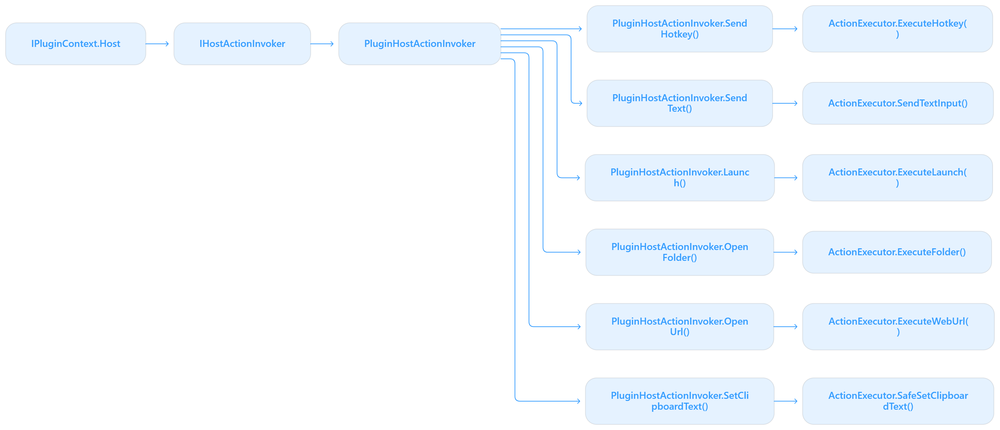


典型调用链：

```text
插件 IActionContribution.ExecuteAsync()
└─ _context.Host.SendHotkey(...)
   └─ PluginHostActionInvoker.SendHotkey()
      └─ ActionExecutor.ExecuteHotkey()
```

适配层位于：

```text
WinPieGestures/Plugin/PluginHostServices.cs
```

职责关系：

- 插件负责声明动作和业务流程。
- 主程序继续负责输入模拟、剪贴板、启动程序、打开文件夹等成熟实现。
- 插件不应直接引用 `ActionExecutor`。
- `PluginHostServices.cs` 将 SDK 接口转接到宿主内部实现。
- 能力门禁由 `PluginHostActionInvoker` 和 `PluginGatedService` 执行。

## 12. 三条插件调用路径

`PluginRuntime` 在构造函数中注册三条路径：

```text
PluginRuntime.PluginRuntime(...)
├─ _paths.Register(Actions)
├─ _paths.Register(Interactions)
└─ _paths.Register(WheelStructures)
```

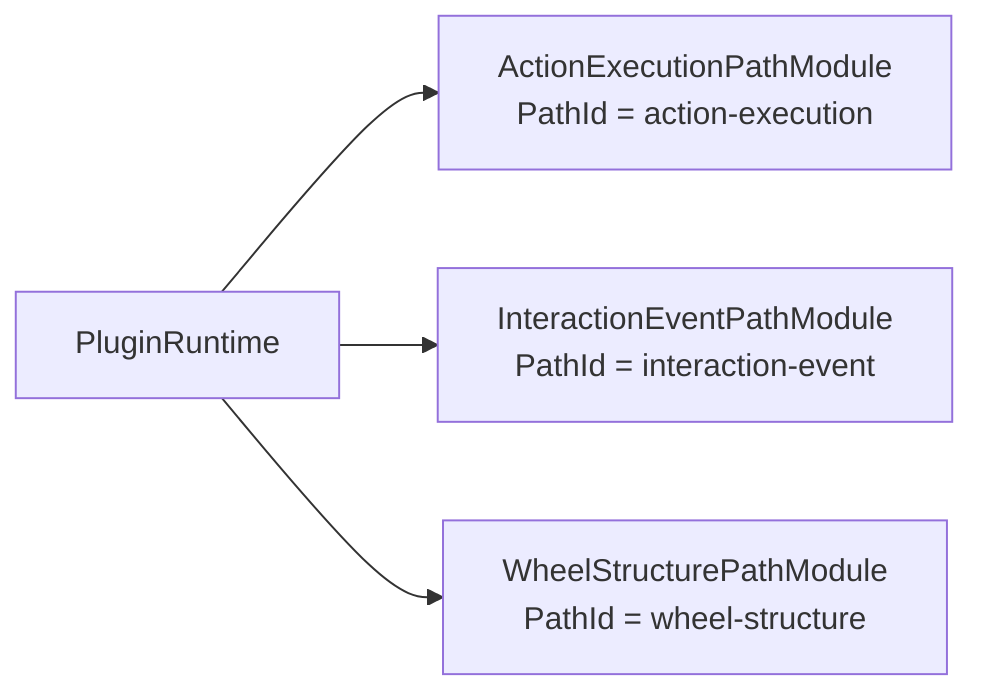
```mermaid
flowchart LR
    RUNTIME["PluginRuntime"]
    ACTION["ActionExecutionPathModule\nPathId = action-execution"]
    EVENT["InteractionEventPathModule\nPathId = interaction-event"]
    WHEEL["WheelStructurePathModule\nPathId = wheel-structure"]

    RUNTIME --> ACTION
    RUNTIME --> EVENT
    RUNTIME --> WHEEL
```

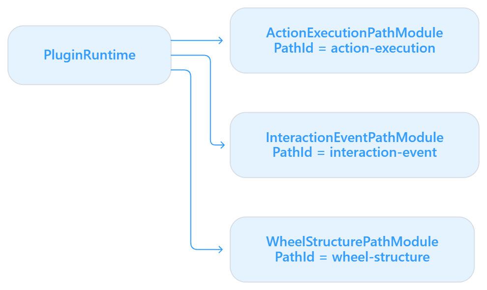


### 12.1 动作执行路径

状态：**已实际使用，是当前的主路径。**

入口：

```text
PluginRuntime.ExecuteAction()
PluginRuntime.ExecuteClaimedAction()
```

实现：

```text
ActionExecutionPathModule.Execute()
ActionExecutionPathModule.ExecuteClaimed()
```

包含：

- 动作查找；
- 惰性加载；
- 参数校验；
- 插件自定义校验；
- `Sequential` / `Background` 调度；
- 超时与取消；
- 活动调用租约；
- 健康度和熔断。

### 12.2 交互事件路径

状态：**兼容骨架已存在，部分事件订阅可用，统一事件队列尚未完成。**

现有接口：

```text
PluginRuntime.RegisterWheelOpening()
PluginRuntime.RegisterWheelClosed()
PluginRuntime.RaiseWheelOpening()
PluginRuntime.RaiseWheelClosed()
```

实现：

```text
InteractionEventPathModule.RegisterWheelOpening()
InteractionEventPathModule.RegisterWheelClosed()
InteractionEventPathModule.RaiseWheelOpening()
InteractionEventPathModule.RaiseWheelClosed()
```

统一事件入口：

```text
PluginRuntime.PublishInteractionEvent()
└─ InteractionEventPathModule.Publish()
   └─ 当前返回 0
```

当前结论：

- `OnWheelOpening` / `OnWheelClosed` 兼容订阅有具体处理；
- `PublishInteractionEvent()` 只是稳定接缝；
- 正式的统一交互事件队列尚未完成。

### 12.3 轮盘结构路径

状态：**安全占位，尚未向插件开放正式结构契约。**

入口：

```text
PluginRuntime.QueryWheelStructureAsync()
```

实现：

```text
WheelStructurePathModule.QueryAsync()
└─ PluginWheelStructureSnapshot.Empty
```

当前不会让插件直接创建或重建 `RadialWindow`，也不会向插件暴露 `WheelProfile`、`ActionItem` 或 WPF 控件。

## 13. 最终职责边界

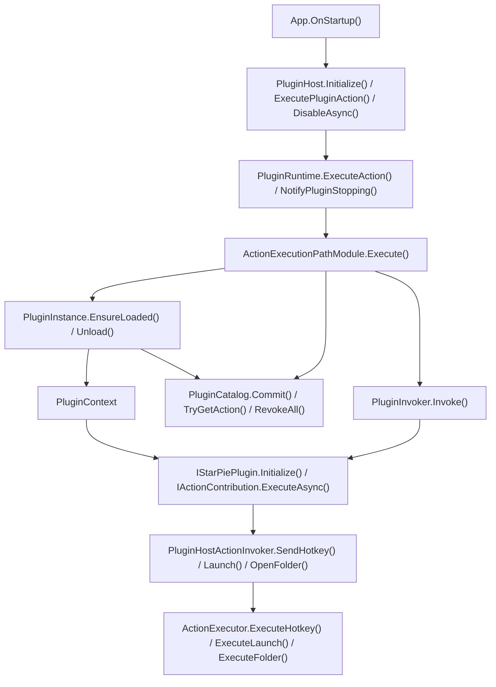
```mermaid
flowchart TB
    APP["App.OnStartup()"]
    HOST["PluginHost.Initialize() / ExecutePluginAction() / DisableAsync()"]
    RUNTIME["PluginRuntime.ExecuteAction() / NotifyPluginStopping()"]
    PATH["ActionExecutionPathModule.Execute()"]
    INSTANCE["PluginInstance.EnsureLoaded() / Unload()"]
    CATALOG["PluginCatalog.Commit() / TryGetAction() / RevokeAll()"]
    CONTEXT["PluginContext"]
    SDK["IStarPiePlugin.Initialize() / IActionContribution.ExecuteAsync()"]
    INVOKER["PluginInvoker.Invoke()"]
    SERVICE["PluginHostActionInvoker.SendHotkey() / Launch() / OpenFolder()"]
    CORE["ActionExecutor.ExecuteHotkey() / ExecuteLaunch() / ExecuteFolder()"]

    APP --> HOST
    HOST --> RUNTIME
    RUNTIME --> PATH
    PATH --> INSTANCE
    INSTANCE --> CONTEXT
    CONTEXT --> SDK
    INSTANCE --> CATALOG
    PATH --> CATALOG
    PATH --> INVOKER
    INVOKER --> SDK
    SDK --> SERVICE
    SERVICE --> CORE
```

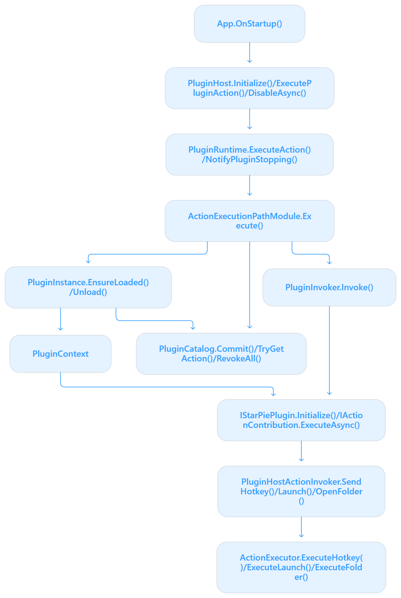


| 层 | 具体节点 | 责任 |
|---|---|---|
| 主程序入口层 | `App.OnStartup()` | 启动插件系统 |
| 宿主门面层 | `PluginHost` | 对主程序暴露唯一插件入口 |
| 运行时组合层 | `PluginRuntime` | 组合路径、激活和调用治理 |
| 路径层 | `ActionExecutionPathModule` | 定义动作执行语义 |
| 生命周期层 | `PluginInstance` | 管理单个插件的加载、停用和卸载 |
| 隔离层 | `PluginLoadContext` | 隔离并卸载插件程序集 |
| 注册层 | `PluginCatalog` | 保存已经提交的贡献点 |
| 插件上下文层 | `PluginContext` | 向插件暴露 SDK 服务 |
| SDK 契约层 | `IStarPiePlugin`、`IActionContribution` | 插件实现的公共接口 |
| 调度层 | `PluginInvoker` | 超时、取消、后台执行和失败统计 |
| 宿主服务层 | `PluginHostActionInvoker` | 将 SDK 调用转到主程序功能 |
| 主程序执行层 | `ActionExecutor`、`WindowTiler` 等 | 执行真实系统操作 |

## 14. 关键类和方法速查

| 类或方法 | 所属文件 | 作用 |
|---|---|---|
| `PluginHost.Initialize()` | `WinPieGestures/Plugin/PluginHost.cs` | 初始化插件系统 |
| `PluginHost.SyncFromDisk()` | `WinPieGestures/Plugin/PluginHost.cs` | 同步磁盘插件和登记表 |
| `PluginHost.CommitInstallAsync()` | `WinPieGestures/Plugin/PluginHost.cs` | 完成插件安装登记 |
| `PluginHost.ExecutePluginAction()` | `WinPieGestures/Plugin/PluginHost.cs` | 执行标准 `Plugin` 动作 |
| `PluginHost.ExecuteClaimedAction()` | `WinPieGestures/Plugin/PluginHost.cs` | 执行官方插件认领的历史动作 |
| `PluginHost.DisableAsync()` | `WinPieGestures/Plugin/PluginHost.cs` | 停用并等待插件结束 |
| `PluginRuntime.ExecuteAction()` | `WinPieGestures/Plugin/PluginRuntime.cs` | 进入动作调用路径 |
| `PluginRuntime.NotifyPluginStopping()` | `WinPieGestures/Plugin/PluginRuntime.cs` | 广播插件停止事件 |
| `PluginPathRegistry.Register()` | `WinPieGestures/Plugin/PluginPathModules.cs` | 注册调用路径模块 |
| `PluginActivationCoordinator.EnsureLoaded()` | `WinPieGestures/Plugin/PluginPathModules.cs` | 检查状态并惰性加载插件 |
| `PluginCallCoordinator.Invoke()` | `WinPieGestures/Plugin/PluginRuntime.cs` | 统一包装路径调用和异常治理 |
| `PluginInstance.EnsureLoaded()` | `WinPieGestures/Plugin/PluginInstance.cs` | 在加载锁内加载单个插件 |
| `PluginInstance.LoadCore()` | `WinPieGestures/Plugin/PluginInstance.cs` | 扫描、加载、初始化和提交贡献点 |
| `PluginInstance.TryAcquireInvocation()` | `WinPieGestures/Plugin/PluginInstance.cs` | 获取活动调用租约 |
| `PluginInstance.BeginStopping()` | `WinPieGestures/Plugin/PluginInstance.cs` | 拒绝新调用并等待活动调用排空 |
| `PluginInstance.Unload()` | `WinPieGestures/Plugin/PluginInstance.cs` | 清理插件并卸载 ALC |
| `PluginCatalog.BeginSession()` | `WinPieGestures/Plugin/PluginCatalog.cs` | 创建原子注册会话 |
| `PluginCatalog.Commit()` | `WinPieGestures/Plugin/PluginCatalog.cs` | 提交动作、图标、词条和设置页 |
| `PluginCatalog.TryGetAction()` | `WinPieGestures/Plugin/PluginCatalog.cs` | 查询运行时动作 |
| `PluginContext` | `WinPieGestures/Plugin/PluginContext.cs` | 实现 `IPluginContext` |
| `PluginActionRegistry.Register()` | `WinPieGestures/Plugin/PluginContext.cs` | 暂存动作贡献点 |
| `PluginInvoker.Invoke()` | `WinPieGestures/Plugin/PluginInvoker.cs` | 统一执行插件动作 |
| `PluginInvoker.InvokeSequential()` | `WinPieGestures/Plugin/PluginInvoker.cs` | 串行动作调度 |
| `PluginInvoker.InvokeInBackground()` | `WinPieGestures/Plugin/PluginInvoker.cs` | 后台动作调度 |
| `PluginInvocationLease.Dispose()` | `WinPieGestures/Plugin/PluginInstance.cs` | 释放活动调用租约 |
| `PluginScanner.ScanInstalledPlugin()` | `WinPieGestures/Plugin/PluginScanner.cs` | 静态扫描已安装插件 |
| `PluginManifestReader.TryLoad()` | `WinPieGestures/Plugin/PluginManifestReader.cs` | 读取插件清单 |
| `PluginLoadContext.Load()` | `WinPieGestures/Plugin/PluginLoadContext.cs` | 隔离加载插件依赖 |
| `PluginHostActionInvoker.SendHotkey()` | `WinPieGestures/Plugin/PluginHostServices.cs` | 将 SDK 快捷键调用转到宿主 |
| `PluginHostActionInvoker.Launch()` | `WinPieGestures/Plugin/PluginHostServices.cs` | 将启动程序调用转到宿主 |
| `PluginHostActionInvoker.OpenFolder()` | `WinPieGestures/Plugin/PluginHostServices.cs` | 将打开文件夹调用转到宿主 |
| `ActionExecutor.Execute()` | `WinPieGestures/ActionExecutor.cs` | 主程序动作总入口 |
| `ActionExecutor.ExecuteHotkey()` | `WinPieGestures/ActionExecutor.cs` | 执行快捷键模拟 |
| `ActionExecutor.ExecuteLaunch()` | `WinPieGestures/ActionExecutor.cs` | 执行程序启动 |
| `ActionExecutor.ExecuteFolder()` | `WinPieGestures/ActionExecutor.cs` | 执行文件夹打开 |

## 15. 一句话总结

```text
PluginHost 是唯一门面；
PluginRuntime 负责统一调用治理；
PluginPathModule 负责具体调用语义；
PluginInstance 负责单插件生命周期；
PluginCatalog 负责运行时贡献点；
PluginContext 负责 SDK 边界；
PluginInvoker 负责安全执行；
ActionExecutor 等主程序类负责真正的宿主功能。
```

插件可以拥有自己的业务逻辑，但不能越过 `IPluginContext` 直接访问主程序内部类型。

